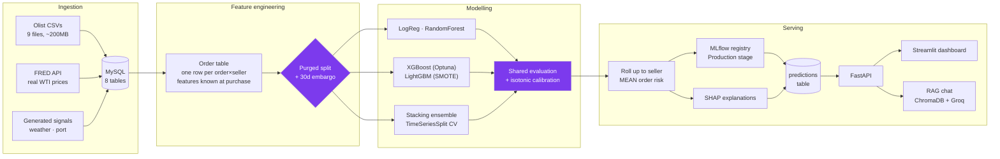

# SENTRIX — Delivery-Risk Intelligence

Predicts whether an individual order will miss its promised delivery date,
rolls those predictions up into a per-seller risk queue, explains **why** for
each seller, and lets a non-technical user interrogate the results in plain
English.

Built on **99,441 real orders** from 3,095 real Brazilian e-commerce sellers,
with a real outcome label — not a simulated dataset.


<!-- LIVE:START -->
**Live demo:** _deploying_ · **API docs:** _deploying_

_Both run on a free tier and sleep after 15 minutes idle — the first request
takes about 50 seconds to wake them. Everything after that is instant._
<!-- LIVE:END -->

---

## The problem

A marketplace's operations team can chase maybe a hundred sellers a week. There
are three thousand. Late deliveries cost refunds, support contacts and repeat
custom — but only after they have already happened, and the team finds out from
the complaint, not before.

SENTRIX scores every parcel at the moment it is placed, then ranks sellers by
the **mean** risk of their recent parcels, so the hundred that get chased are
the right hundred.

## What this project is actually about

The interesting part of SENTRIX is not the model. It is that **two earlier
versions of it were measurably wrong, and this repo contains the scripts that
proved it** rather than a tidied-up history.

| Version | Target | What killed it |
|---|---|---|
| v1 | Any late order in the next 30 days, per seller | A forest given **only** the three `order_count_*` columns scored ROC-AUC **0.7317**; the full 47-feature model scored **0.6494**. The model lost to one column. |
| v2 | Forward late *rate* ≥ 15%, per seller | Worse. Every tabular model landed **below 0.5** ROC-AUC on the test block. |
| v3 | **This one.** Will *this order* miss *its* promised date? | — |

**v1 was a volume detector.** With a per-order late rate near 8%, P(at least one
late | *n* orders) = 1 − 0.92ⁿ. Ship 100 parcels and that is 99.97%; ship three
and it is 22%. The label was close to a deterministic function of how busy a
seller was, and `scripts/ablation.py` measured exactly that.

**v2 broke in the mirror image.** A 15% threshold with a 5-order minimum still
means "at least one late order" at *n*=5, while at *n*=100 a seller at the
marketplace rate has P(rate ≥ 15%) ≈ 0.4%. The positive rate now *fell* with
volume. Olist volume grows through 2018, so the training block (17.3% positive)
and the test block (12.2%) were different regimes, the learned relationship
inverted, and AUC landed under a coin flip.

**Then the question became whether a seller-level target is predictable at
all.** `scripts/label_screen.py` built a label that neutralises volume by
construction — worst 20% of forward late rate within month × volume-decile
cells. It worked: volume-only ROC **0.4946**, base-rate drift **1.59** points.
The model then scored **0.5056**. Removing the confound removed the performance
with it.

`scripts/label_screen2.py` found out why, with one measurement that needed no
model at all — **split-half reliability**. Cut the forward window in half and
correlate a seller's late rate in days 1–15 against their own rate in days
16–30:

| min forward orders | split-half *r* | persistence AUC |
|---|---|---|
| 5 | 0.206 | 0.5172 |
| 10 | 0.243 | 0.5212 |
| 20 | 0.318 | 0.5126 |
| 30 | 0.344 | 0.4610 |
| 50 | **0.388** | 0.4895 |

Split-half reliability climbs — so a real seller effect exists. Persistence AUC,
the trailing 30-day late rate used directly as a score, sits at **0.46–0.52 at
every denominator**. A seller running late this month is genuinely running late
*all month*, and that says almost nothing about next month.

**Lateness here is a shock — a bad batch, a carrier problem, a demand spike —
not a stable seller trait.** No feature set predicts a target that does not
persist. That is why this project models orders.

### Why the rollup is a mean

Predicting orders and *summing* the risk would reintroduce the v1 confound
immediately: a seller shipping 200 parcels would top the queue permanently,
not because their parcels are risky but because they have more of them.

So a seller's risk is the **mean** predicted risk of their recent orders. That
is a rate. It cannot be inflated by shipping more. The volume confound is closed
by the shape of the statistic rather than argued away in a README.

---

## Architecture



DVC versions the data, Airflow schedules the refresh, Evidently watches for
drift, and GitHub Actions runs lint, the unit suite and the split-integrity
tests on every push.

The full retrain-and-gate job — stand up MySQL, load 100K orders, train six
models, fail the build if PR-AUC drops below a floor — is **manual only**. It
needs the raw Olist CSVs, which are Kaggle-licensed and so cannot be
redistributed from this repo or a public DVC remote. Claiming a green badge for
a job that cannot fetch its own data would be worth less than saying this.

---

## The part worth reading: what stops this from being wrong

Most of the engineering effort here went into *not* reporting an inflated
number. Three specific failure modes were found and fixed, and each is now
covered by a test that fails the build.

### 1. The label overlaps the split

Rows are dated by **purchase** time, but the label resolves at **delivery** —
one to three weeks later. A plain chronological cut therefore leaves training
orders whose outcomes land inside the test window, and the lagged seller-history
features of early test orders are computed from outcomes that training rows
already revealed. Train and test share information, the held-out score is
optimistic, and nothing raises an exception — leakage does not crash, it just
makes every metric go up.

The split is therefore **purged and embargoed**, the standard treatment for
overlapping-label time series:

```
2016-09 ──────── TRAIN ──────── ╎ 30d embargo ╎ CALIB ╎ 30d embargo ╎ ──── TEST ──── 2018-10
                                     rows in the gaps are deliberately discarded
```

Exact block sizes are printed by `purged_temporal_split` on every run and land
in `pivot-run.log`, so they cannot drift out of date in this file.

The middle block exists so probability calibration can be fitted on data the
model never trained on and the test set never touches. Fitting the calibrator
on the test set would quietly turn the test score into a training score.

### 2. Models evaluated on different row sets cannot be ranked

PR-AUC depends on the base rate of the set it is measured on, so two models
scored on different subsets cannot be put in one ranked table — the ordering
means nothing.

This was a live bug, not a hypothetical. The sequence model could not score a
seller's first 30 days (no window to look back over), so it was evaluated on a
*subset* while the tabular models used every row, and all six were printed in
one table ranked by PR-AUC. Worse, the dropped rows were not a random sample:
early seller-days carry a higher late rate, so excluding them pulled the test
block's base rate from **16.8% down to 15.0%** across 39% fewer rows. The subset
was easier as well as smaller, which flatters whichever model is measured on it.

Two guards now make that class of error loud:

- `compare_models` **raises** if handed result arrays of differing lengths,
  rather than printing a table that mixes base rates.
- `run_evaluation` compares a loaded sequence model's saved feature space
  against the current preprocessor and refuses to score if they disagree. A
  checkpoint trained on 46 seller-day features will otherwise load happily
  against order-level input and return confident nonsense.

The evaluation set is reported as a fraction of the full test block on every
run, so a silent coverage drop shows up in the log instead of in the metrics.

### 3. Leakage reintroduced one level down

The outer split was fixed, but two inner loops still used shuffled k-fold CV on
the same panel:

- **The stacking ensemble.** A stacker trains its meta-learner on out-of-fold
  base predictions; with k-fold, fold 1 is scored by models fitted on its own
  future. The result was ROC-AUC **0.538** on held-out data — worse than every
  one of its own base models, which is the signature of a meta-learner fitted on
  leaked predictions. Now `TimeSeriesSplit`.
- **Optuna's tuning loop.** Same problem, same fix. Optuna was optimising
  against an inflated score and therefore selecting hyperparameters that
  overfit.

### Tested, not asserted

`tests/test_split_integrity.py` verifies the embargo is at least the label
horizon, that no row appears in two blocks, that rows are genuinely discarded,
that mismatched evaluation sets are rejected, that calibration reduces
calibration error, and that an impossible embargo fails loudly instead of
training on four rows.

---

## Results

<!-- RESULTS:START -->

Evaluated on **19,564 held-out orders** from the final chronological block, base rate **5.2%**. Train and test are separated by a 30-day embargo, so no training label resolves inside the evaluation window.

### Model comparison

Every model is scored on the *same* rows. PR-AUC depends on the base rate, so models evaluated on different subsets cannot be ranked against each other — `compare_models` raises rather than print a table that mixes them.

| Model | PR-AUC | vs. random | ROC-AUC | KS | Capture @10% | Lift @10% | Brier |
|---|---|---|---|---|---|---|---|
| **Stacking Ensemble** | **0.1528** | 2.93x | 0.7613 | 0.3958 | 32.1% | 3.21x | 0.3606 |
| XGBoost (Optuna-tuned) | 0.1494 | 2.86x | 0.7551 | 0.3804 | 32.1% | 3.21x | 0.1571 |
| Logistic Regression | 0.1167 | 2.24x | 0.7158 | 0.3244 | 25.1% | 2.51x | 0.4029 |
| LightGBM (SMOTE) | 0.0884 | 1.69x | 0.6360 | 0.1914 | 20.8% | 2.08x | 0.0544 |
| Random Forest | 0.0527 | 1.01x | 0.5249 | 0.0869 | 8.8% | 0.88x | 0.1869 |

### What an operations team actually gets

PR-AUC summarises a curve nobody runs. A team can review a fixed number of orders per cycle, so the number that matters is how much of the risk they capture at that capacity.

| Review the top… | Orders flagged | Of all late orders, caught | vs. random |
|---|---|---|---|
| 5% | 978 | **18.5%** | 3.70x |
| 10% | 1,956 | **29.9%** | 2.99x |
| 20% | 3,913 | **51.3%** | 2.57x |

### Calibration

`Stacking Ensemble` is calibrated with isotonic regression fitted on the held-out calibration block — data the model never trained on and the test set never touches.

| | Raw score | Calibrated |
|---|---|---|
| Brier score | 0.3606 | **0.0492** |
| Expected calibration error | 0.5422 | **0.0328** |
| Mean predicted probability | 0.5944 | 0.0210 |

Observed rate on the evaluation set: **0.0522**. Ranking metrics are invariant to any monotone rescaling of the score, so they are blind to this entirely — which is why a risk product needs both.

### Operating point

The decision threshold is chosen by minimising expected cost at a **10:1** ratio (a missed late parcel vs. an analyst's wasted review), not by defaulting to 0.5 — which silently assumes the two errors are equally bad.

- Cost-optimal threshold: **0.0284** (F1-optimal would be 0.0426)
- Precision 0.135 · Recall 0.510 · F1 0.213
- Expected cost vs. not modelling at all: **18.3% lower**
- Confusion matrix: TP=521 FP=3,343 FN=500 TN=15,200
- Alert volume at that threshold: **19.8% of all orders**

That last line is why the capacity view above is the one to run the product on. A 10:1 cost ratio says false alarms are cheap, so the cost-minimising threshold alerts on a large share of the population — arithmetically right, operationally useless. Supply a real cost ratio and re-derive it; supply a weekly review capacity and read the capture table instead.

*Label horizon 30 days. Generated by `scripts/render_results.py` from `artifacts/evaluation/` — do not edit this section by hand.*

<!-- RESULTS:END -->

### Findings stated plainly rather than buried

- **The headline metric of v1 was an artefact, and the repo proves it.**
  `scripts/ablation.py` ranks sellers by `order_count_30d` with no model at all
  and beats the 47-feature champion. That script stays in the repository as a
  regression test on the current design, not as history.
- **Removing a confound can remove the performance.** The volume-neutral label
  in `label_screen.py` scored 0.4946 on volume alone — exactly as designed — and
  the model then scored 0.5056. A clean label is necessary, not sufficient.
- **Some targets are not predictable, and that is a finding.** Split-half
  reliability rises to 0.388 while persistence AUC stays at 0.46–0.52. A seller's
  lateness is real *within* a month and does not carry *across* months. Two
  versions of this project were spent learning that.
- **Random Forest collapsed and the boosted models did not.** On the order
  grain the forest scores ROC-AUC **0.5249** — barely above chance — while the
  tuned XGBoost reaches **0.7551** and the stack **0.7613**. The order-level
  signal lives in interactions (a tight promise *and* a long route *and* a
  heavy parcel), and a depth-10 forest on 93 mostly-sparse one-hot columns
  cannot find them. This inverted the seller-grain result, where the forest won
  — a reminder that model choice is a property of the data, not a preference.
- **A single column, negated, ranks better than the ensemble.** `promised_days`
  scores ROC-AUC **0.2011** raw, which is not "useless" — 0.20 is as far from
  chance as 0.80. A longer promised window means less lateness. The marketplace's
  own delivery estimate already encodes distance and carrier, so the model's job
  is not to rediscover it but to say *when that estimate is optimistic*. The
  ablation now negates single columns before scoring them, because reporting
  0.2011 as a weak result would have flattered the model it is compared against.
- **The ablation was benchmarking against the wrong model.** It fitted a fixed
  RandomForest for every variant, including the "full model" row — so on this
  data every subset was being compared against a near-random baseline, and any
  subset could look competitive. It now fits the champion family. A tool that
  checks for self-deception is worth nothing if it deceives itself.
- **A ranking score is not a probability.** LightGBM trains on SMOTE-resampled
  data; Logistic Regression and Random Forest use `class_weight="balanced"`. All
  rank fine and all emit inflated probabilities. Isotonic calibration fixes the
  scale without touching the ranking — see the Results section for the numbers
  from the current run.
- **The sequence model was dropped on purpose.** An order is not a timestep in a
  seller's history; it is an independent shipment whose risk is set by its route,
  weight and promised window. Keeping an LSTM for the sake of having one would
  have meant allocating ~700MB to model a sequence that does not carry the
  signal. `--stages lstm` still runs it if you want to see that for yourself.

### On the cost-optimal threshold

At a 10:1 miss-to-false-alarm ratio the cost-minimising threshold flags **55% of
all seller-days**. That is arithmetically correct and operationally useless — no
team reviews half its sellers. It is reported because it is what the stated cost
ratio actually implies, and it is a useful reductio: if false alarms really were
a tenth as expensive as misses, you would alert on almost everything.

The number to run the product on is the capacity view — top 5%, 10%, 20% — which
is why risk bands here are percentile-based rather than absolute probability
cuts. A stakeholder who supplies a genuine cost ratio can re-derive the threshold
from `find_cost_optimal_threshold`; a stakeholder who supplies a weekly review
capacity reads it straight off the capture table.

---

## Data provenance — read this before judging the results

| Layer | Source | Status |
|---|---|---|
| Sellers, orders, order items, products | Olist Brazilian E-Commerce (Kaggle, CC BY-NC-SA) | **REAL** |
| Customer reviews (sentiment features) | Olist | **REAL** |
| Late-delivery label | `order_delivered_customer_date > order_estimated_delivery_date` | **REAL** |
| Commodity (fuel) volatility | FRED — real daily WTI oil prices | **REAL** |
| Weather / port congestion | Generated per real seller-state + real date | **SYNTHETIC** |

**Scale:** 3,095 sellers · 99,441 orders · 112,650 order items · 99,224 reviews.

**Two different rates, often confused:** 8.11% of *orders* arrive late. 22.47%
of *seller-days* are positive — a seller-day is positive if **any** order in the
following 30 days is late, so one late order marks up to 30 rows. The models are
trained at seller-day grain, so 22.47% is the base rate every metric below is
measured against.

### Why one signal layer is synthetic, and why *that* layer

Orders span **Sept 2016 – Oct 2018**, so an external-signal API has to return
data *for those dates*. Each free tier was checked against that requirement:

| Signal | Free-tier reality | Decision |
|---|---|---|
| **Commodity** | FRED serves decades of free daily history by date range | **Use real data** |
| Weather | OpenWeatherMap free tier is current/forecast; history is paid | Generate |
| Port congestion | No free public source for historical port congestion | Generate |

Calling a live weather API here would have silently matched 2026 weather against
2017 orders — worse than generating it honestly. So the one signal free tooling
can legitimately support was made real, and the rest are generated
**independently of the label**, so they cannot manufacture a correlation.

**Provenance is enforced in the database, not just claimed here.** Every
`external_signals` row stores `is_synthetic` (0 = real FRED, 1 = generated), and
`test_signal_provenance_is_explicit` fails the build if any row is ambiguous or
if weather/port is ever mislabelled as real.

---

## Features — order grain, every column knowable at purchase time

| Family | Provenance | Examples |
|---|---|---|
| Promise | REAL | `promised_days` (marketplace's own estimate minus purchase), `shipping_limit_days`, `handover_share` |
| Shipment | REAL | freight ratio, price per item, log weight, log volume, density, item count |
| Route | REAL | `zip_gap` (CEP-prefix distance proxy), `same_state`, seller/customer zip region |
| Calendar | REAL | purchase hour, day of week, month, weekend flag |
| Lagged history | REAL | seller's and destination state's observed late rate, **as of 30 days before the order** |
| Category | REAL | product category, top 20 + `other` |

**The lag on history is the point.** An order placed today has no delivery
outcome for roughly two weeks, so a seller's "current" late rate is not
knowable at purchase time. An unlagged expanding mean would feed the model
outcomes that do not exist yet in production — the same class of error as the
volume confound, just harder to see. `add_lagged_history` does a `merge_asof`
back to the cumulative state at `purchase_date − 30d`.

Explicitly excluded, each one individually tempting:

| Column | Why it cannot be a feature |
|---|---|
| `order_delivered_customer_date` | This *is* the outcome |
| `delay_days` | This is the outcome, in days |
| `order_delivered_carrier_date` | The handover happens after purchase |
| `order_approved_at` | Known hours later, not at purchase |

`build_order_feature_table` raises if any column starting with
`order_delivered`, `order_approved` or `delay_days` survives into the table —
a guard, not a comment.

The preprocessor is fitted on the training slice only: fitting the scaler or
imputer on the full table leaks test-period statistics even when the row-level
split is correct.

---

## Stack

MySQL · pandas · scikit-learn · XGBoost · LightGBM · PyTorch · Optuna · SMOTE ·
SHAP · MLflow · DVC · ChromaDB · LangChain · Groq · FastAPI · Streamlit · pytest
· Evidently · Docker · GitHub Actions · Airflow

---

## Run it

```bash
python -m venv venv && venv\Scripts\activate     # Windows
pip install -r requirements.txt
copy .env.example .env                           # MYSQL_PASSWORD is required

python -m src.ingestion.schema                   # create tables
python -m src.ingestion.olist_loader             # load real Olist data
python -m src.ingestion.synthetic_signals        # real FRED + flagged synthetic
python scripts/build_order_features.py           # order-level feature table

python -m src.models.trainer                     # baseline + boosting + ensemble
python -m src.evaluation.run_evaluation          # rank, calibrate, pick threshold
python -m src.evaluation.generate_predictions    # score orders, roll up to sellers
python -m src.models.mlflow_tracking             # register the winner
python -m src.rag.indexer                        # build the chat index

python scripts/render_results.py                 # regenerate this README's results
pytest tests/ -v

uvicorn api.app:app --reload --port 8000         # terminal 1
streamlit run frontend/dashboard.py              # terminal 2
```

Or `docker compose up`.

Training stages are independently resumable —
`python -m src.models.trainer --stages boosting` re-runs one stage without
retraining the rest.

To reproduce the evidence that shaped the target:

```bash
python scripts/ablation.py        # how much of the signal is just order volume
python scripts/label_screen.py    # six candidate labels on one purged split
python scripts/label_screen2.py   # split-half reliability — is it predictable at all
```

---

## API

| Endpoint | Purpose |
|---|---|
| `GET /health` | Liveness + which model MLflow has in Production |
| `GET /summary` | Portfolio KPIs, risk histogram, per-state aggregates |
| `GET /sellers?risk_band=` | Every seller ranked by calibrated risk |
| `GET /explain/{seller_id}` | SHAP attribution for one seller's score |
| `POST /chat` | RAG-grounded Q&A over predictions and real review text |
| `GET /metrics` | Full model comparison table |

---

## Limitations

Stated because a portfolio project that claims none is not being read carefully.

- **The weather and port signals are generated.** Their measured contribution is
  therefore not evidence about real weather or real ports. The real-data
  families carry the model; the synthetic layer is a clearly-labelled
  demonstration of how an external-signal join would work.
- **One marketplace, one country, one two-year window.** Nothing here is
  evidence the model transfers to a different logistics network.
- **The split is temporal, not grouped — the same sellers appear in train and
  test.** That is deliberate: in production you score orders from sellers you
  already have history for, so a temporal split is the honest simulation. But it
  measures *temporal* generalisation and says nothing about cold start.
  `GroupKFold` on `seller_id` would answer that and would score lower, since the
  lagged-history features are exactly what a new seller does not have. The
  promise, route and shipment families do not depend on seller history, so a
  cold-start model is possible here — it is simply not what these numbers
  measure.
- **`promised_days` is the marketplace's own delivery estimate.** It is
  legitimately known at purchase and it is informative precisely because it
  already encodes distance and carrier. But it means the model partly learns
  *when the marketplace's own estimator is optimistic*. On a platform that sets
  promises differently, that feature's meaning changes.
- **`zip_gap` is a proxy, not a distance.** Brazilian CEP prefixes are allocated
  broadly geographically, so the gap between two prefixes correlates with
  distance without being it. Real haversine distance from a geocoding table
  would be strictly better.
- **Risk bands are capacity-based, not absolute.** "Critical" means the worst 5%
  of sellers scored right now, not a fixed probability. At an ~8% order late
  rate a correctly calibrated model rarely emits high absolute probabilities, so
  fixed cutoffs would leave the top bands permanently empty — making a
  well-calibrated model look worse than an overconfident one.
- **Sellers with fewer than 5 orders in the rollup window are not ranked at
  all.** A mean over two parcels is noise. That is a deliberate coverage gap:
  the queue is shorter and every row in it means something.
- **Airflow needs its own environment.** It pins `sqlalchemy<2.0`, which
  conflicts with FastAPI and MLflow. See `requirements-airflow.txt`; the DAG in
  `pipelines/` is written for that separation and triggers the pipeline by
  subprocess, never by shared imports.
- **The calibration block is narrow** after the 30-day embargo takes its bite.
  Isotonic regression has enough data to fit, but the block's base rate differs
  from the test period, which is why calibration closes most of the gap and not
  all of it. Widening `calibration_size` in `config.yaml` fixes it at the cost of
  training rows.
- **Two dead ends are kept in the repository on purpose.** `feature_eng.py` and
  both `label_screen` scripts build and evaluate the seller-level targets that
  did not work. They are the evidence for why the project has the shape it does,
  and deleting them would make the repo look tidier and say less.
- **The RAG embedder falls back to TF-IDF** when `huggingface.co` is
  unreachable. Retrieval mechanics are identical and it switches back
  automatically.

---

## Deployment

Two Docker services on Render's free tier, built straight from this repo.

### The serving tier carries none of the training stack

The API does **no model inference at request time**. `/sellers`, `/explain`,
`/summary` and `/metrics` all read rows that `generate_predictions.py` computed
offline, SHAP attributions included. So the deployed image needs none of this:

| Dropped | Size | Why it isn't needed |
|---|---|---|
| torch | ~800 MB | the sequence model is a training-time comparison |
| xgboost + lightgbm | ~200 MB | training only |
| shap | ~50 MB | attributions are precomputed into the database |
| mlflow | ~200 MB | the registry lives with the training environment |

`requirements-serve.txt` is what actually gets installed. That is the difference
between an image no free tier will run and one that fits in 512 MB.

The one thing serving genuinely needs at request time is an **embedder**, to
turn a chat question into a vector. That comes from chromadb's bundled ONNX
build of `all-MiniLM-L6-v2` — same model as sentence-transformers, running on
onnxruntime instead of PyTorch.

### No database server

Free managed Postgres **expires after 30 days**. A demo link that dies a month
after it goes on a CV is worse than no link.

The serving tier reads a few thousand precomputed rows, so it reads them from a
SQLite file committed with the code (`scripts/export_serving_data.py` builds it
from MySQL). Nothing to expire, nothing to leak, no cold-start connection.
`SENTRIX_DB_URL` is what switches `src/ingestion/db.py` between the two.

```bash
# rebuild the serving snapshot after retraining
python scripts/export_serving_data.py

# run the serving stack locally, exactly as deployed
docker compose -f docker-compose.serve.yml up --build
```

---

## Repository map

```
src/ingestion/      Olist loaders, MySQL schema, FRED + generated signals
src/preprocessing/  seller-day feature builder, fitted transform pipeline
src/models/         baselines, boosting, stacking, LSTM, SHAP, MLflow
src/evaluation/     shared-set evaluation, calibration, ops metrics, scoring
src/monitoring/     Evidently drift detection
src/rag/            ChromaDB index, retriever, LangChain + Groq chain
api/                FastAPI service
frontend/           Streamlit dashboard
tests/              unit + integration + split-integrity suites
pipelines/          Airflow DAG
```
