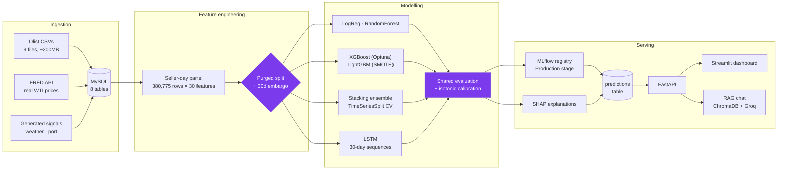

# SENTRIX — Seller Delivery-Risk Intelligence

Predicts which marketplace sellers will miss a delivery in the next 30 days,
explains **why** for each one, and lets a non-technical user interrogate the
results in plain English.

Built on **99,441 real orders** from 3,095 real Brazilian e-commerce sellers,
with a real outcome label — not a simulated dataset.

<!-- Replace the two URLs below once CI has run and the demo is deployed. -->


---

## The problem

A marketplace's operations team can chase maybe a hundred sellers a week. There
are three thousand. Late deliveries cost refunds, support contacts and repeat
custom — but only after they have already happened, and the team finds out from
the complaint, not before.

SENTRIX ranks every seller by the probability they will be late in the next 30
days, so the hundred that get chased are the right hundred.

**Where it lands:** reviewing the top 10% of the seller list surfaces a
disproportionate share of the sellers who actually go late — see
[Results](#results) for the measured capture rate and lift.

---

## Architecture



DVC versions the data, Airflow schedules the refresh, Evidently watches for
drift, and GitHub Actions gates every merge on both the tests and the model's
PR-AUC.

---

## The part worth reading: what stops this from being wrong

Most of the engineering effort here went into *not* reporting an inflated
number. Three specific failure modes were found and fixed, and each is now
covered by a test that fails the build.

### 1. The label overlaps the split

The label asks "is this seller late in the next 30 days?" A plain chronological
cut leaves training rows whose labels are decided by events inside the test
window. Train and test then share information and the held-out score is
optimistic — and nothing raises an exception, because leakage does not crash,
it just makes every metric go up.

The split is therefore **purged and embargoed**, the standard treatment for
overlapping-label time series:

```
2016-09 ─────────── TRAIN ─────────── 2018-02-10  ╎ 30d ╎  CALIB  ╎ 30d ╎  ──── TEST ──── 2018-10
                 239,210 rows                     embargo  10,793   embargo   76,815 rows
                                                            rows
                                        53,957 rows deliberately discarded
```

The middle block exists so probability calibration can be fitted on data the
model never trained on and the test set never touches. Fitting the calibrator
on the test set would quietly turn the test score into a training score.

### 2. Six models, two different test sets

The LSTM cannot score a seller's first 30 days — it has no window to look back
over — so it was structurally evaluated on a *subset* of the test rows, with a
different size and a different base rate from the tabular models. All six were
then printed in one table ranked by PR-AUC, which is not comparable across base
rates. The ranking was meaningless.

Now the LSTM defines a shared evaluation index and every other model is scored
on exactly those rows. `compare_models` raises if handed results of differing
lengths, so the bad table cannot come back.

The LSTM was also being fed **raw unscaled features** while every other model
got the fitted `StandardScaler` — an unscaled `days_since_last_late` of 9999
saturates the gates on the first forward pass. It now consumes the same
transformed matrix as everything else.

### 3. Leakage reintroduced one level down

The outer split was fixed, but two inner loops still used shuffled k-fold CV on
the same panel:

- **The stacking ensemble.** A stacker trains its meta-learner on out-of-fold
  base predictions; with k-fold, fold 1 is scored by models fitted on its own
  future. The result was ROC-AUC **0.538** on held-out data — worse than every
  one of its own base models, which is the signature of a meta-learner fitted on
  leaked predictions. Now `TimeSeriesSplit`.
- **Optuna's tuning loop.** Same problem, same fix. Optuna was optimising
  against an inflated score and therefore selecting hyperparameters that
  overfit.

### Tested, not asserted

`tests/test_split_integrity.py` verifies the embargo is at least the label
horizon, that no row appears in two blocks, that rows are genuinely discarded,
that mismatched evaluation sets are rejected, that calibration reduces
calibration error, and that an impossible embargo fails loudly instead of
training on four rows.

---

## Results

<!-- RESULTS:START -->

*Run `python scripts/render_results.py` after training to generate this section
from `artifacts/evaluation/`.*

<!-- RESULTS:END -->

### Two findings stated plainly rather than buried

- **The simplest model is competitive.** With well-engineered features, Logistic
  Regression holds its own against the boosted trees. That is what baselines are
  for, and it is the more defensible model to actually deploy — a risk team can
  read its coefficients.
- **A ranking score is not a probability.** LightGBM trains on SMOTE-resampled
  data and Logistic Regression and Random Forest use `class_weight="balanced"`.
  All three rank well and all three emit systematically inflated probabilities.
  Isotonic calibration on held-out data fixes the scale without touching the
  ranking — visible as a large ECE drop with PR-AUC unchanged.

---

## Data provenance — read this before judging the results

| Layer | Source | Status |
|---|---|---|
| Sellers, orders, order items, products | Olist Brazilian E-Commerce (Kaggle, CC BY-NC-SA) | **REAL** |
| Customer reviews (sentiment features) | Olist | **REAL** |
| Late-delivery label | `order_delivered_customer_date > order_estimated_delivery_date` | **REAL** |
| Commodity (fuel) volatility | FRED — real daily WTI oil prices | **REAL** |
| Weather / port congestion | Generated per real seller-state + real date | **SYNTHETIC** |

**Scale:** 3,095 sellers · 99,441 orders · 112,650 order items · 99,224 reviews.

**Two different rates, often confused:** 8.11% of *orders* arrive late. 22.47%
of *seller-days* are positive — a seller-day is positive if **any** order in the
following 30 days is late, so one late order marks up to 30 rows. The models are
trained at seller-day grain, so 22.47% is the base rate every metric below is
measured against.

### Why one signal layer is synthetic, and why *that* layer

Orders span **Sept 2016 – Oct 2018**, so an external-signal API has to return
data *for those dates*. Each free tier was checked against that requirement:

| Signal | Free-tier reality | Decision |
|---|---|---|
| **Commodity** | FRED serves decades of free daily history by date range | **Use real data** |
| Weather | OpenWeatherMap free tier is current/forecast; history is paid | Generate |
| Port congestion | No free public source for historical port congestion | Generate |

Calling a live weather API here would have silently matched 2026 weather against
2017 orders — worse than generating it honestly. So the one signal free tooling
can legitimately support was made real, and the rest are generated
**independently of the label**, so they cannot manufacture a correlation.

**Provenance is enforced in the database, not just claimed here.** Every
`external_signals` row stores `is_synthetic` (0 = real FRED, 1 = generated), and
`test_signal_provenance_is_explicit` fails the build if any row is ambiguous or
if weather/port is ever mislabelled as real.

---

## Features — 30 columns at seller-day grain

| Family | Provenance | Examples |
|---|---|---|
| Delivery history | REAL | rolling 7/14/30-day late counts and rates, trend, days since last late |
| Review sentiment | REAL | rolling mean review score, bad-review counts |
| External signals | MIXED | commodity volatility (real FRED), weather / port (generated) by state |
| Profile & peer | REAL | lifetime late rate, state-peer late rate, tenure |

Every feature looks strictly **backward** via `.shift(1)`; the label looks
strictly **forward**. The preprocessor is fitted on the training slice only —
fitting the scaler or imputer on the full table leaks test-period statistics
even when the row-level split is correct.

---

## Stack

MySQL · pandas · scikit-learn · XGBoost · LightGBM · PyTorch · Optuna · SMOTE ·
SHAP · MLflow · DVC · ChromaDB · LangChain · Groq · FastAPI · Streamlit · pytest
· Evidently · Docker · GitHub Actions · Airflow

---

## Run it

```bash
python -m venv venv && venv\Scripts\activate     # Windows
pip install -r requirements.txt
copy .env.example .env                           # MYSQL_PASSWORD is required

python -m src.ingestion.schema                   # create tables
python -m src.ingestion.olist_loader             # load real Olist data
python -m src.ingestion.synthetic_signals        # real FRED + flagged synthetic
python scripts/build_features.py                 # 380,775-row feature table

python -m src.models.trainer                     # all four stages
python -m src.evaluation.run_evaluation          # rank, calibrate, pick threshold
python -m src.evaluation.generate_predictions    # score + explain every seller
python -m src.models.mlflow_tracking             # register the winner
python -m src.rag.indexer                        # build the chat index

python scripts/render_results.py                 # regenerate this README's results
pytest tests/ -v

uvicorn api.app:app --reload --port 8000         # terminal 1
streamlit run frontend/dashboard.py              # terminal 2
```

Or `docker compose up`.

Training stages are independently resumable —
`python -m src.models.trainer --stages boosting` re-runs one stage without
retraining the rest.

---

## API

| Endpoint | Purpose |
|---|---|
| `GET /health` | Liveness + which model MLflow has in Production |
| `GET /summary` | Portfolio KPIs, risk histogram, per-state aggregates |
| `GET /sellers?risk_band=` | Every seller ranked by calibrated risk |
| `GET /explain/{seller_id}` | SHAP attribution for one seller's score |
| `POST /chat` | RAG-grounded Q&A over predictions and real review text |
| `GET /metrics` | Full model comparison table |

---

## Limitations

Stated because a portfolio project that claims none is not being read carefully.

- **The weather and port signals are generated.** Their measured contribution is
  therefore not evidence about real weather or real ports. The real-data
  families carry the model; the synthetic layer is a clearly-labelled
  demonstration of how an external-signal join would work.
- **One marketplace, one country, one two-year window.** Nothing here is
  evidence the model transfers to a different logistics network.
- **The split is temporal, not grouped — the same sellers appear in train and
  test.** That is deliberate: in production you score sellers you already have
  history for, so a temporal split is the honest simulation of that. But it
  means these numbers measure *temporal* generalisation and say nothing about
  cold start. Measuring "how well does this score a seller it has never seen?"
  needs a `GroupKFold` on `seller_id`, and would score lower — the delivery
  history and lifetime-rate families, which carry most of the signal, are
  precisely what a new seller does not have.
- **Risk bands are capacity-based, not absolute.** "Critical" means the worst 5%
  of sellers scored right now, not a fixed probability. With a 22% base rate a
  correctly calibrated model rarely exceeds 0.75, so absolute cutoffs would leave
  the top bands permanently empty — which would make a well-calibrated model look
  worse than an overconfident one.
- **Airflow needs its own environment.** It pins `sqlalchemy<2.0`, which
  conflicts with FastAPI and MLflow. See `requirements-airflow.txt`; the DAG in
  `pipelines/` is written for that separation and triggers the pipeline by
  subprocess, never by shared imports.
- **The RAG embedder falls back to TF-IDF** when `huggingface.co` is
  unreachable. Retrieval mechanics are identical and it switches back
  automatically.

---

## Repository map

```
src/ingestion/      Olist loaders, MySQL schema, FRED + generated signals
src/preprocessing/  seller-day feature builder, fitted transform pipeline
src/models/         baselines, boosting, stacking, LSTM, SHAP, MLflow
src/evaluation/     shared-set evaluation, calibration, ops metrics, scoring
src/monitoring/     Evidently drift detection
src/rag/            ChromaDB index, retriever, LangChain + Groq chain
api/                FastAPI service
frontend/           Streamlit dashboard
tests/              unit + integration + split-integrity suites
pipelines/          Airflow DAG
```
